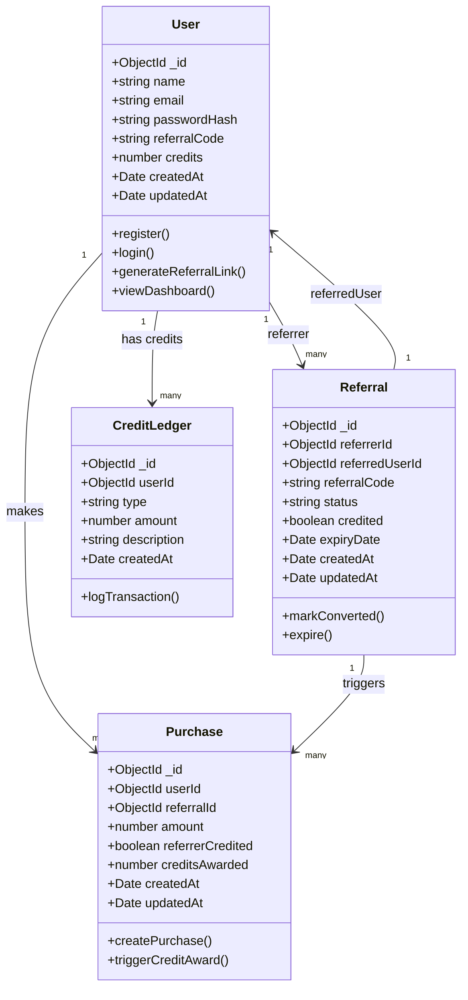
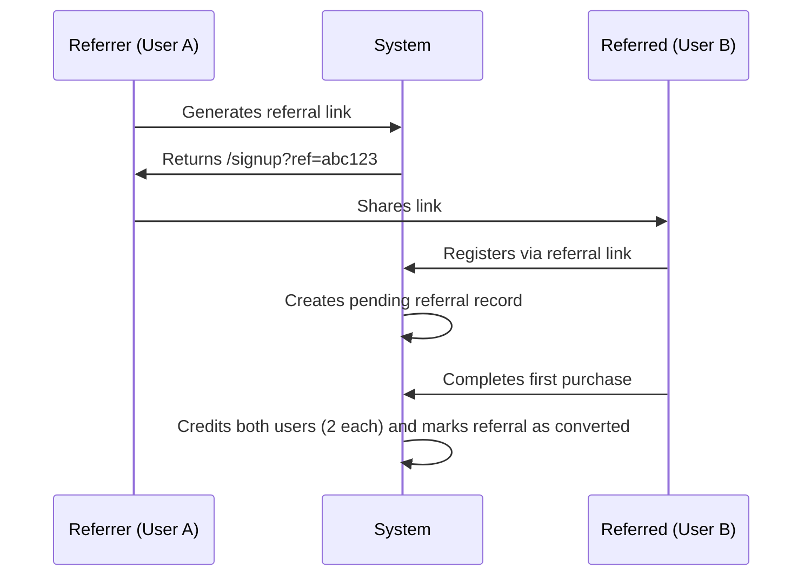

# ReferralHub – Complete Referral Management System

**ReferralHub** is a full-stack referral management system designed to streamline customer referrals, automate reward distribution, and provide real-time analytics.
Built using **Next.js**, **Node.js**, and **MongoDB**, it demonstrates scalable architecture, secure authentication, and an enterprise-grade feature set suitable for modern businesses.

---

## Table of Contents

1. [Project Overview](#project-overview)
2. [System Architecture](#system-architecture)
3. [Tech Stack](#tech-stack)
4. [System Workflow](#system-workflow)
5. [Documentation Tools](#documentation-tools)
6. [Quick Start Guide](#quick-start-guide)
7. [Testing the Complete Flow](#testing-the-complete-flow)
8. [System Features](#system-features)
9. [Security Implementation](#security-implementation)
10. [Performance and Scalability](#performance-and-scalability)
11. [Demo Script](#demo-script)
12. [Support and Contact](#support-and-contact)

---

## Project Overview

**ReferralHub** is a comprehensive referral system that enables businesses to:

* Track referrals through unique codes and personalized links
* Reward users with credits for successful conversions
* Monitor referral performance and user engagement
* Analyze ROI through detailed dashboards and analytics
* Scale securely with a modern, production-ready architecture

### Business Value

* **Boost customer acquisition** through incentive-based referrals
* **Lower marketing costs** by leveraging existing customers
* **Automate reward distribution** securely and transparently
* **Provide actionable insights** through data-driven analytics

---

## System Architecture

###  UML Use Case Diagram

```mermaid
usecaseDiagram
    actor "User" as U
    actor "Referrer" as R
    actor "Admin" as A

    rectangle ReferralHub {
        (Register Account) as UC1
        (Login / Logout) as UC2
        (Generate Referral Link) as UC3
        (Share Referral Link) as UC4
        (Accept Referral & Sign Up) as UC5
        (Make Purchase) as UC6
        (Earn Credits) as UC7
        (Redeem Credits) as UC8
        (View Dashboard) as UC9
        (View Leaderboard) as UC10
        (Manage Users) as UC11
        (Monitor Referrals) as UC12
        (Analyze System Reports) as UC13
    }

    U --> UC1
    U --> UC2
    U --> UC6
    U --> UC7
    U --> UC8
    U --> UC9
    U --> UC10

    R --> UC3
    R --> UC4
    R --> UC5
    R --> UC6
    R --> UC7
    R --> UC9

    A --> UC11
    A --> UC12
    A --> UC13

    UC5 .> UC1 : <<includes>>
    UC6 .> UC7 : <<triggers>>
    UC7 .> UC9 : <<updates>>
    UC8 .> UC9 : <<updates>>
```

---

### UML Class Diagram



---

### Architectural Principles

1. **Separation of Concerns:** Frontend, backend, and database operate as independent layers.
2. **Scalability:** Modular and microservice-ready design.
3. **Security-Driven:** JWT authentication, schema validation, and secure cookies.
4. **Data Integrity:** Transaction-safe credit operations.
5. **Developer Experience:** Clear documentation and streamlined workflows.

---

## Tech Stack

### Frontend

| Technology        | Purpose                                     |
| ----------------- | ------------------------------------------- |
| **Next.js 14**    | Server-side rendering and optimized routing |
| **TypeScript**    | Static type safety and maintainability      |
| **Tailwind CSS**  | Rapid and consistent UI development         |
| **Framer Motion** | Smooth UI animations                        |
| **Zustand**       | Lightweight state management                |
| **Axios**         | API communication and error handling        |
| **Zod**           | Type-safe input validation                  |

### Backend

| Technology             | Purpose                               |
| ---------------------- | ------------------------------------- |
| **Node.js**            | Backend runtime environment           |
| **Express.js**         | RESTful API framework                 |
| **TypeScript**         | Type safety and better code structure |
| **MongoDB + Mongoose** | NoSQL database with schema modeling   |
| **JWT**                | Stateless authentication              |
| **bcrypt**             | Password hashing                      |
| **Zod**                | Validation of request payloads        |

### Documentation and Development

| Tool                  | Purpose                                     |
| --------------------- | ------------------------------------------- |
| **Swagger / OpenAPI** | API documentation and testing               |
| **Storybook**         | UI component documentation                  |
| **ESLint & Prettier** | Code quality and formatting                 |
| **ts-node-dev**       | TypeScript hot reloading during development |

---

## System Workflow

### 1. User Registration and Authentication

* New users can register with or without a referral code.
* Passwords are securely hashed using `bcrypt`.
* A unique referral code is generated for each new user.
* JWT tokens are created and stored in secure, HttpOnly cookies.
* If a referral code is provided, a pending referral relationship is established.

---

### 2. Referral Flow



---

### 3. Purchase and Credit System

* Each purchase triggers validation for referral eligibility.
* If it’s the referred user’s first purchase, both users receive **2 credits each**.
* Transactions are executed atomically to prevent double-crediting.
* The referral status updates from *Pending* to *Converted*.

---

### 4. Dashboard and Analytics

* Users view referral stats, conversion rates, and credit balance in real time.
* Dashboard provides key metrics such as:

  * Total referrals sent
  * Converted referrals
  * Available credits
  * Personalized referral link

---

## Documentation Tools

### Swagger API Documentation

* Interactive API testing and validation
* Displays endpoint details, request/response schemas, and authentication handling

### Storybook Component Library

* Displays UI components in isolation with adjustable controls
* Supports responsive and accessibility testing

---

## Quick Start Guide

### Prerequisites

* Node.js v18+
* npm v9+
* MongoDB Atlas account or local MongoDB instance

**Access Points**

* Frontend: https://referral-2.vercel.app
* Swagger: https://referral-beta.vercel.app/api-docs

---

## Testing the Complete Flow

1. Create Referrer (User A) → note referral code
2. Share referral link → `/signup?ref=abc123`
3. Referred user (User B) signs up via link
4. User B makes purchase → credits both users
5. Dashboard updates:

   * User A: 1 referral, 1 converted, 2 credits
   * User B: 0 referrals, 0 converted, 2 credits

 **Expected:**
Referral marked “converted” and credits updated atomically.

---

## System Features

### Authentication & Security

* JWT with HttpOnly cookies
* bcrypt password hashing
* Zod validation
* CORS + CSRF protection

### Referral Management

* 8-character unique codes
* Referral tracking & expiration (30 days)
* Status transitions: *pending → converted → expired*

### Credit & Reward System

* 2-credit reward per successful referral
* Atomic transactions
* CreditLedger audit logs

### Analytics & Reporting

* Real-time metrics and leaderboards
* Referral conversion analytics

### User Experience

* Responsive Tailwind + Framer Motion UI
* Dark mode support
* Social sharing integration

---

## Security Implementation

```typescript
res.cookie('access_token', token, {
  httpOnly: true,
  secure: process.env.NODE_ENV === 'production',
  sameSite: 'lax',
  maxAge: 7 * 24 * 60 * 60 * 1000
});
```

* Zod ensures safe payloads
* MongoDB transactions prevent credit inconsistencies
* TLS-protected DB connections

---

## Performance & Scalability

* **Indexed queries & connection pooling** for database
* **Next.js caching & SSR** for performance
* **Stateless JWT auth** for horizontal scaling
* **Microservice-ready** architecture


