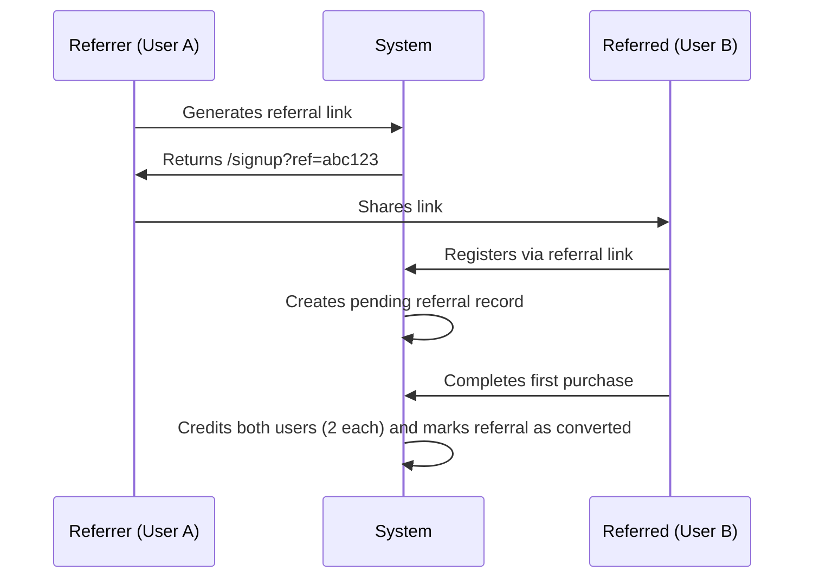

# ReferralHub – Complete Referral Management System

**ReferralHub** is a full-stack referral management system designed to streamline customer referrals, automate reward distribution, and provide real-time analytics.
Built using **Next.js**, **Node.js**, and **MongoDB**, it demonstrates scalable architecture, secure authentication, and an enterprise-grade feature set suitable for modern businesses.

---

## Table of Contents

1. [Project Overview](#project-overview)
2. [System Architecture](#system-architecture)
3. [Tech Stack](#tech-stack)
4. [System Workflow](#system-workflow)
5. [Documentation Tools](#documentation-tools)
6. [Quick Start Guide](#quick-start-guide)
7. [Testing the Complete Flow](#testing-the-complete-flow)
8. [System Features](#system-features)
9. [Security Implementation](#security-implementation)
10. [Performance and Scalability](#performance-and-scalability)
11. [Demo Script](#demo-script)
12. [Support and Contact](#support-and-contact)

---

## Project Overview

**ReferralHub** is a comprehensive referral system that enables businesses to:

* Track referrals through unique codes and personalized links
* Reward users with credits for successful conversions
* Monitor referral performance and user engagement
* Analyze ROI through detailed dashboards and analytics
* Scale securely with a modern, production-ready architecture

### Business Value

* **Boost customer acquisition** through incentive-based referrals
* **Lower marketing costs** by leveraging existing customers
* **Automate reward distribution** securely and transparently
* **Provide actionable insights** through data-driven analytics

---

## System Architecture

```mermaid
graph TB
    subgraph Frontend
        A[Next.js Application] --> B[React Components]
        B --> C[State Management (Zustand)]
        C --> D[API Layer (Axios)]
    end
    
    subgraph Backend
        E[Express API] --> F[JWT Authentication Middleware]
        F --> G[Controllers and Business Logic]
    end
    
    subgraph Database
        H[MongoDB Atlas] --> I[Users Collection]
        H --> J[Referrals Collection]
        H --> K[Purchases Collection]
        H --> L[Credit Ledger]
    end

    D --> E
    G --> H
```

### Architectural Principles

1. **Separation of Concerns:** Frontend, backend, and database operate as independent layers.
2. **Scalability:** Modular and microservice-ready design.
3. **Security-Driven:** JWT authentication, schema validation, and secure cookies.
4. **Data Integrity:** Transaction-safe credit operations.
5. **Developer Experience:** Clear documentation and streamlined workflows.

---

## Tech Stack

### Frontend

| Technology        | Purpose                                     |
| ----------------- | ------------------------------------------- |
| **Next.js 14**    | Server-side rendering and optimized routing |
| **TypeScript**    | Static type safety and maintainability      |
| **Tailwind CSS**  | Rapid and consistent UI development         |
| **Framer Motion** | Smooth UI animations                        |
| **Zustand**       | Lightweight state management                |
| **Axios**         | API communication and error handling        |
| **Zod**           | Type-safe input validation                  |

### Backend

| Technology             | Purpose                               |
| ---------------------- | ------------------------------------- |
| **Node.js**            | Backend runtime environment           |
| **Express.js**         | RESTful API framework                 |
| **TypeScript**         | Type safety and better code structure |
| **MongoDB + Mongoose** | NoSQL database with schema modeling   |
| **JWT**                | Stateless authentication              |
| **bcrypt**             | Password hashing                      |
| **Zod**                | Validation of request payloads        |

### Documentation and Development

| Tool                  | Purpose                                     |
| --------------------- | ------------------------------------------- |
| **Swagger / OpenAPI** | API documentation and testing               |
| **Storybook**         | UI component documentation                  |
| **ESLint & Prettier** | Code quality and formatting                 |
| **ts-node-dev**       | TypeScript hot reloading during development |

---

## System Workflow

### 1. User Registration and Authentication

* New users can register with or without a referral code.
* Passwords are securely hashed using `bcrypt`.
* A unique referral code is generated for each new user.
* JWT tokens are created and stored in secure, HttpOnly cookies.
* If a referral code is provided, a pending referral relationship is established.

### 2. Referral Flow



### 3. Purchase and Credit System

* Each purchase triggers validation for referral eligibility.
* If it’s the referred user’s first purchase, both users receive **2 credits each**.
* Transactions are executed atomically to prevent double-crediting.
* The referral status updates from *Pending* to *Converted*.

### 4. Dashboard and Analytics

* Users view referral stats, conversion rates, and credit balance in real time.
* The dashboard provides key metrics such as:

  * Total referrals sent
  * Converted referrals
  * Available credits
  * Personalized referral link

---

## Documentation Tools

### Swagger API Documentation

* Available at: `http://localhost:4000/api-docs`
* Provides interactive API testing and validation
* Displays endpoint details, request/response schemas, and authentication handling

**Benefits**

* Enables rapid frontend integration
* Simplifies debugging and testing
* Ensures consistent API behavior across teams

### Storybook Component Library

* Accessible at: `http://localhost:6006`
* Displays all UI components in isolation with adjustable controls
* Supports responsive and accessibility testing
* Provides live documentation derived from TypeScript props

---

## Quick Start Guide

### Prerequisites

* Node.js v18+
* npm v9+
* MongoDB Atlas account or local MongoDB instance

### Setup Instructions

#### 1. Clone the Repository

```bash
git clone <repository>
cd referral-system
```

#### 2. Backend Setup

```bash
cd backend
npm install
```

Create a `.env` file with:

```
MONGODB_URI=<your_mongodb_connection_string>
JWT_SECRET=<your_jwt_secret>
PORT=4000
CORS_ORIGIN=http://localhost:3001
FRONTEND_URL=http://localhost:3001
```

Start the backend:

```bash
npm run dev
```

#### 3. Frontend Setup

```bash
cd frontend
npm install
```

Create `.env.local`:

```
NEXT_PUBLIC_API_BASE=http://localhost:4000
```

Start the frontend:

```bash
npm run dev
```

#### 4. Access Points

* Frontend: [http://localhost:3001](http://localhost:3001)
* Backend API: [http://localhost:4000](http://localhost:4000)
* API Docs (Swagger): [http://localhost:4000/api-docs](http://localhost:4000/api-docs)
* Storybook: [http://localhost:6006](http://localhost:6006)

---

## Testing the Complete Flow

### End-to-End Referral Scenario

1. **Create a Referrer Account:**
   Sign up as User A and note the generated referral code.

2. **Share Referral Link:**
   Copy and share your referral link (e.g., `/signup?ref=abc123`).

3. **Register a Referred User:**
   Open the link in an incognito window, sign up as User B.

4. **Simulate Purchase:**
   User B makes a purchase, triggering the credit distribution.

5. **Verify Dashboard Updates:**

   * User A: 1 referral, 1 converted, 2 credits
   * User B: 0 referrals, 0 converted, 2 credits

### Expected Results

* Both users receive 2 credits on first purchase.
* Referral status updates to “converted.”
* Dashboard reflects updated statistics in real time.
* No duplicate crediting occurs.

---

## System Features

### Authentication and Security

* JWT-based authentication with HttpOnly cookies
* Password hashing with `bcrypt`
* Input validation using `Zod`
* CORS and CSRF protection
* Secure database connections via MongoDB Atlas

### Referral Management

* Unique 8-character referral codes
* Referral link generation and tracking
* Status management (pending → converted → expired)
* Expiration handling (default 30 days)

### Credit and Reward System

* Automatic 2-credit reward for referrer and referred user
* Transaction-safe crediting via MongoDB sessions
* Prevents double-crediting through unique constraints
* Maintains credit history and audit logs

### Analytics and Reporting

* Real-time dashboard metrics
* Conversion and referral trend visualization
* Leaderboards showcasing top referrers
* Activity feeds for recent referral events

### User Experience

* Modern, responsive interface
* Optimized with Tailwind CSS and Framer Motion
* Dark mode support
* Seamless social sharing integration

---

## Security Implementation

### Authentication

JWT tokens are securely stored using HttpOnly cookies:

```typescript
res.cookie('access_token', token, {
  httpOnly: true,
  secure: process.env.NODE_ENV === 'production',
  sameSite: 'lax',
  maxAge: 7 * 24 * 60 * 60 * 1000
});
```

### Data Validation

All user inputs are validated with `Zod` schemas to ensure type safety and prevent malformed requests.

### Database Security

* Unique indexes prevent duplicate referrals.
* Transactions maintain credit consistency.
* Encrypted connections protect data integrity.

---

## Performance and Scalability

### Database Optimization

* Indexed collections for fast lookups
* Aggregation pipelines for reporting
* Connection pooling for high throughput

### Frontend Optimization

* Next.js automatic code splitting and caching
* Lightweight state management with Zustand
* Optimized images and assets

### Backend Scalability

* Stateless JWT architecture supports horizontal scaling
* Microservice-friendly modular design
* Load balancer compatible deployment

### Monitoring

* Health check endpoints
* Structured error logging
* API performance tracking


